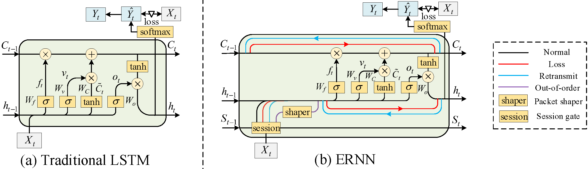
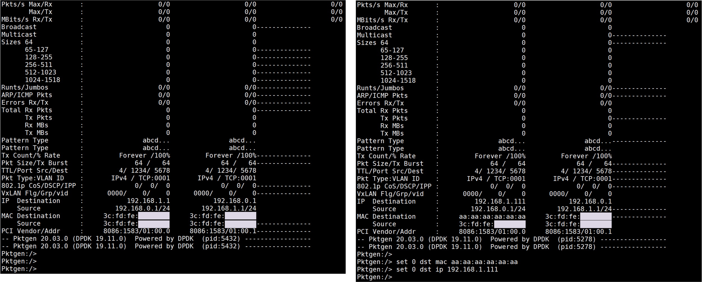
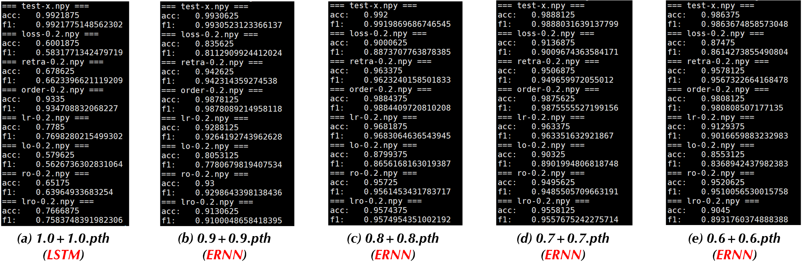

# TDSC_ERNN



**ERNN: Error-Resilient RNN for Encrypted Traffic Detection towards Network-Induced Phenomena**

ERNN is a robust and end-to-end RNN model designed specifically for cybersecurity detection systems (IDS and Malware) to alleviate misclassifications introduced by network-induced phenomena, such as packet loss, retransmission, and out-of-order.

## Network-Induced Phenomena
We consider three main network-induced phenomena.

(i)    Packet loss: It refers to the server-side lost some packets sent from the client-side.

(ii)   Retransmission: It refers to the client repeatedly sending a series of packets for the integrity of the transmission.

(iii)  Out-of-order: It means that the packet received by the server is not in the same sequence as the one sent by the client.

## Testbed Dataplane

Hardware:
- 40 GbE NIC: [DPDK-supported hardwares](https://core.dpdk.org/supported/)
  - e.g., Intel XL710-QDA2

Software:
- Ubuntu 16.04.1 LTS
- Python 3.7
- [DPDK 20.11](http://git.dpdk.org/dpdk-stable/tag/?h=v20.11)
- Pktgen 20.03.0

Usage:
- Install DPDK 20.11 following [Getting Started Guide for Linux](https://doc.dpdk.org/guides-20.11/linux_gsg/index.html).
- Compile DPDK applications.
- Use pdump to capture packets
	```
	./dpdk-pdump -- --pdump 'port=0,queue=*,rx-dev=/tmp/rx.pcap,tx-dev=/tmp/tx.pcap,ring-size=65536' --pdump 'port=1,queue=*,rx-dev=/tmp/rx2.pcap,ring-size=65536'
	```
- Use Pktgen to send packets
	```
	./pktgen -l 0-4 -n 4 -- -P -m [1].0 -m [2].1 -m [3].2 -m [4].3 -s 0:./demo.pcap -s 1:./demo.pcap -s 2:./demo.pcap -s 3:./demo.pcap
	```
- Please configure the destination MAC address and destination IP address in the *Pktgen* interface, e.g., 


Utilizing the data plane can capture real-world packets of network-induced phenomena.

## Requirements

```bash
pip install scipy
pip install numpy
pip install pandas
pip install tqdm
pip install pyecharts
pip install joblib
pip install pickle
pip install sklearn
pip install captum
```

## Example Dataset

If the user does not run on the data plane, it could also simulate packet loss, retransmission, and out-of-order in offline.

The specific generation process leverages the *scapy* library to manipulate the packets from PCAP files. 

The folder *./data_demo/* stores test demo data including normal labels and inputs, as well as problematic packets with 7 combinations. 

## Running

The *./code/ernn.py* stores the model architecture of ERNN. 

Training the model, please set the transition matrix *Fm*. 

```bash
python train.py
```

Test the demo dataset with trained models where in *./code/model_para_eval/*. 
Specifically, the "1.0+1.0.pth" refers to typical LSTM and others are ERNN. 

```bash
python test.py
```


Using the Integrated Gradients method from Captum to interpret the model inference. 

```bash
python interp.py
```

## Interpretability

The attribution matrix generation refers to the Integrated Gradients method from [Captum](https://github.com/pytorch/captum). 

The attribution matrix is equal to the input size and records the influence degree of each position in the input for the inference result. It can help us understand the *dependency dispersion* effect of ERNN.

## References
- [Optimized Invariant Representation of Network Traffic for Detecting Unseen Malware Variants](https://www.usenix.org/conference/usenixsecurity16/technical-sessions/presentation/bartos), Karel Bartos, Michal Sofka, and Vojtech Franc - USENIX Security 2016
- [Kitsune: An Ensemble of Autoencoders for Online Network Intrusion Detection](https://arxiv.org/abs/1802.09089), Yisroel Mirsky, Tomer Doitshman, Yuval Elovici, and Asaf Shabtai - NDSS 2018
- [FS-Net: A Flow Sequence Network For Encrypted Traffic Classification](https://ieeexplore.ieee.org/document/8737507), Chang Liu, Longtao He, Gang Xiong, Zigang Cao, and Zhen Li - INFOCOM 2019
- [Combining supervised and unsupervised learning for zero-day malware detection](https://ieeexplore.ieee.org/document/6567003), Prakash Mandayam Comar, Lei Liu, Sabyasachi Saha, Pang-Ning Tan, and Antonio Nucci - INFOCOM 2013
- [MaMPF: Encrypted Traffic Classification Based on Multi-Attribute Markov Probability Fingerprints](https://ieeexplore.ieee.org/document/8624124), Chang Liu, Zigang Cao, Gang Xiong, Gaopeng Gou, Siu-Ming Yiu, and Longtao He - IWQoS 2018
- [Realtime Robust Malicious Traffic Detection via Frequency Domain Analysis](https://doi.org/10.1145/3460120.3484585), Chuanpu Fu, Qi Li, Meng Shen, and Ke Xu - CCS 2021
