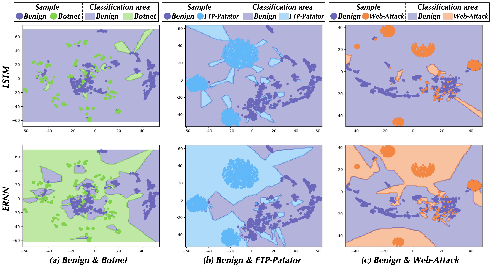

# The Model Decision Boundary Analysis for ERNN
Our goal is to increase the elasticity of the model when against various network-induced phenomena, for which we build mathematical representation for this problem. Consider a trained classifier that achieves learning a model $f: \mathcal{X} \to \mathcal{Y}$, where $x \in \mathcal{X} \in {\mathbb{R}^d}$ is the input, and $\mathcal{Y} = \{1, 2, \cdots C\}$ ( $C$ is the number of classes). Let $y$ denote the ground-truth label of $x$, and the model classifies correctly when $f(x) = y$. Based on unknown network-induced phenomena distribution $\mathcal{V} \sim \mathcal{D}$, we use $x' \in {\mathbb{R}^d}, \left\| x' - x \right\| \le \varepsilon$ to represent a problematic packet sequence. Subsequently, we define the natural error as the misclassification of ''clean'' samples: $E_{nat} = \mathbb{E}\_{x \in \mathcal{X}}\\{f(x) \ne y\\}$; and the problematic-packet error as the misclassification of ''network-induced phenomenon'' samples: $E_{pro} = \mathbb{E}\_{x' \sim \mathcal{D}}\\{\exists x' \mathrm{s.t.} \\| x' - x \\| \le \varepsilon \wedge f(x') \ne y \\}$. Therefore, the overall model error can be expressed as the sum of both, i.e., $E_{ove} = E_{nat} + E_{pro}$, the overall error is equal to the natural error when $\varepsilon = 0$. In general, the smaller $E_{ove}$, the error-resilient ability of the model tends to be higher, which is the goal of ERNN.

	
     
    
Figure. The model decision boundary of LSTM and ERNN.

In order to measure the model error of LSTM and ERNN, we further employ TSNE [1] to visualize their model decision boundary for in-depth analysis. The below figure displays three groups of cases including (a) Benign & Botnet, (b) Benign & FTP-Patator, (c) Benign & Web-Attack. It is clear that LSTM performs lots of misclassifications for attack samples, i.e., fall into benign classification areas. Since when there is a network-induced phenomenon, the sample exhibits a more "discrete" distribution, while elastic-lack LSTM cannot adapt to these instances. For example, in subfigure (b), we observe that there are three clusters of FTP attack samples (blue mark), yet LSTM only could identify the central area. This can be interpreted as those edge points in clusters (far from the center) being generated by network-induced phenomena. Nevertheless, ERNN maintains good error-resilient performance that manifested in the better generalization ability of classification boundaries. Therefore, it can be obtained that $E_{ove}^{ERNN} < E_{ove}^{LSTM}$, namely, ERNN indeed improves the robustness of LSTM by involving the error-resilient mechanism (i.e., a session gate).

[1] Laurens van der Maaten and Geoffrey Hinton. Visualizing data using t-SNE. Journal of machine learning research, 9(Nov):2579--2605, 2008.
